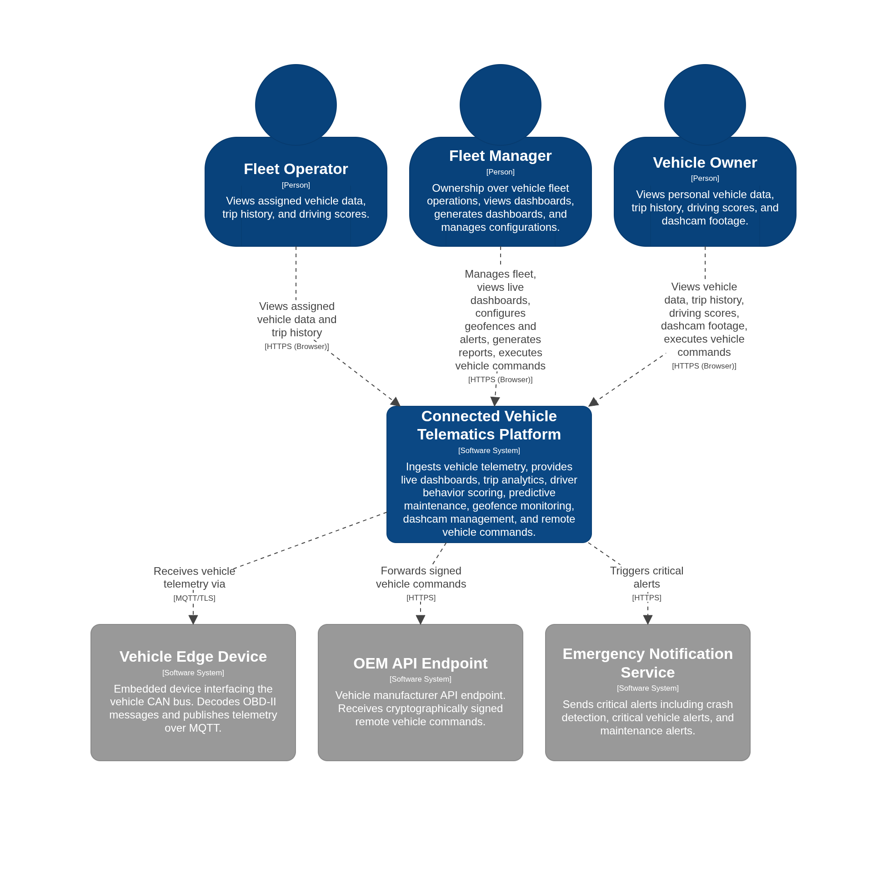
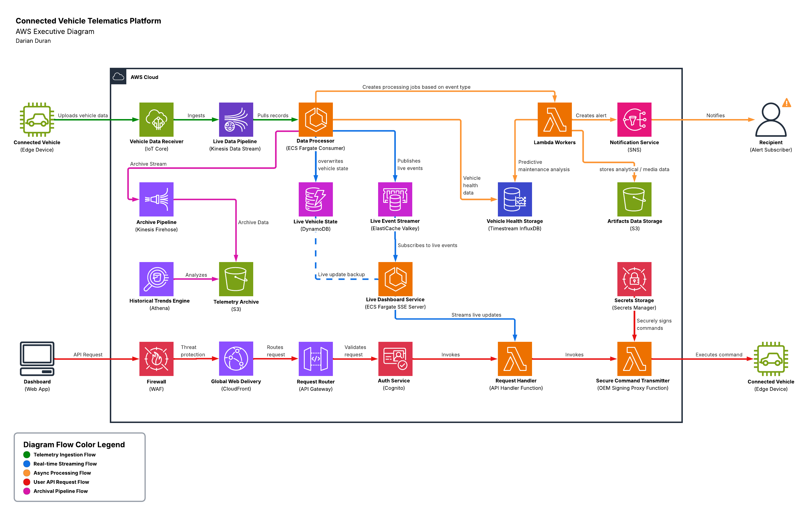

# 1.0 Executive Overview

## 1.1 Business Context

This solution started as a simple personal project to control my vehicle remotely from any device. I wanted to be able to lock/unlock doors, and control HVAC through commands without being tied to the manufacturer's app. As I built it out, I became interested in the data that the vehicle was generating behind the scenes. Processing that data allowed me to build a full telematics platform capable of tracking vehicle data in real-time and delivering meaningful insights to owners.

## 1.2 Problem Statement

Most fleet management solutions providing the same functionality are locked behind expensive monthly subscriptions with proprietary hardware. Individual owners and smaller organizations have no realistic way to access the same visibility and control that enterprise solutions have. I wanted to build a solution that was able to match functionality with full ownership of my own data, and cheaper infrastructure costs.

## 1.3 Solution Overview

The solution starts with the vehicles themselves. Every modern vehicle constantly generates loads of data that it uses to share information between its internal systems. By installing small devices in each vehicle, we can capture that data and securely transmit it to AWS. As it reaches AWS, that data is processed and powers key workflows for users in the platform.

The platform gives fleet operators and vehicle owners a centralized dashboard used to manage their vehicles. The dashboard updates in real-time as new data are processed, providing users live visibility into their entire fleet.

In the background, the platform is also analyzing data to deliver meaningful insights to users. Data collection and correlation allow users to monitor their driver's behavior and safety level. Vehicle component data is tracked over time to help users spot service-related issues before they escalate. In the event of major incidents, such as detected crashes, the platform sends real-time notifications so users can respond immediately.

At a high-level, these are the main features provided through the solution:

- Real-time vehicle tracking and live map
- Trip analytics with full route replay
- Driver behavior scoring for unsafe driving patterns
- Crash detection and emergency notification
- Geofence monitoring with configurable enter/exit alerts
- Dashcam footage capture linked to driving events
- Remote vehicle command execution with cryptographic signing
- Predictive maintenance analytics
- Charging efficiency tracking
- Long-term historical trend analysis

*Figure 1: C4 Level 1 - System Context Diagram*

## 1.4 Architecture Overview

The architecture is built completely on AWS. The platform prioritizes managed services over self-managed infrastructure to minimize admin overhead. The executive diagram provides a high-level view into how AWS services connect to support platform workflows.

*Figure 2: Executive Architecture Diagram*

## 1.5 Key Benefits

The architecture delivers a fleet telematics platform with enterprise-like features at a cost affordable to individuals or smaller organizations. At 100 vehicles the platform runs under $400/month, compared to most solutions that would easily exceed $1000+. As vehicle count scales, the cost scales with it, 1,000 vehicles would cost around $600/month.

All vehicle data lives in your AWS account. No third party vendor has access or processes it. You control retention, deletion, and who can see it. The platform also masks vehicle identifiers at the ingestion boundary before data ever reaches a data store, so PII data like VINs are never exposed.

Crash detection, geofence violations, and unsafe driving patterns trigger immediate notifications so users can respond in real-time. Potential service-related issues are communicated to the user to prevent vehicle downtime.

The platform works with any vehicle that exposes CAN bus data through a standard OBD-II port. There's no proprietary hardware requirement and no manufacturer lock-in. The infrastructure is built entirely on managed AWS services, keeping admin overhead low and avoiding dependency on any single vendor's ecosystem.

[Next: Requirements](02-requirements.md)
