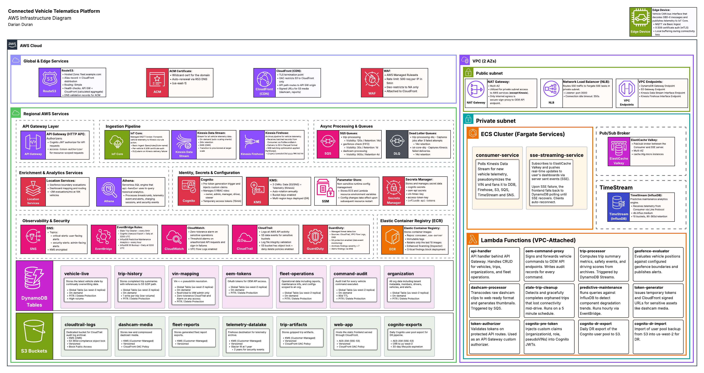
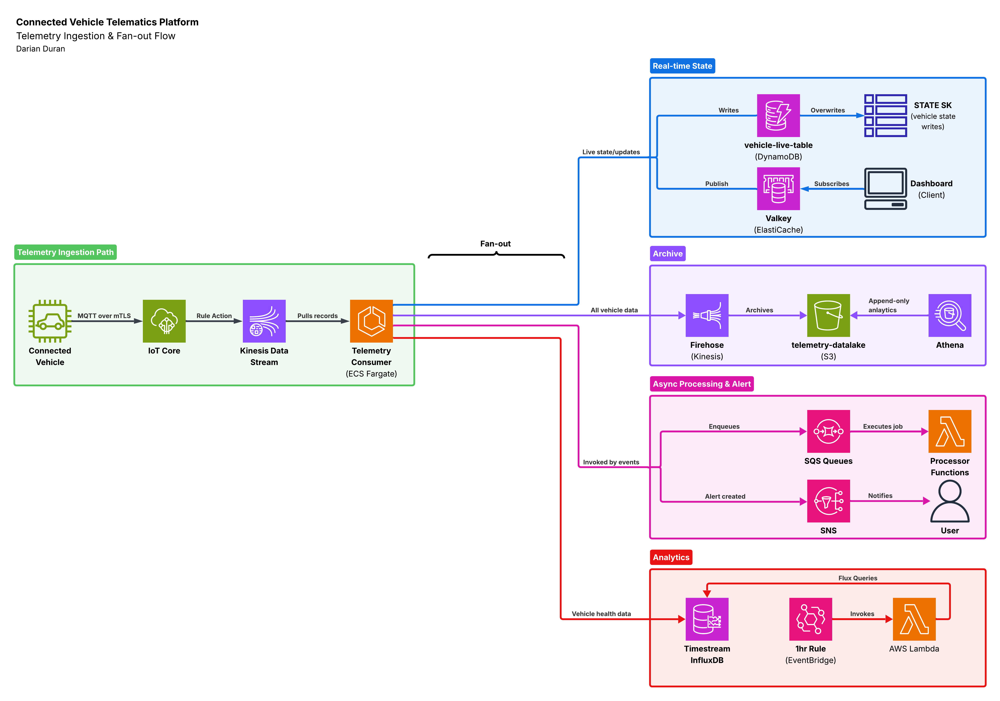
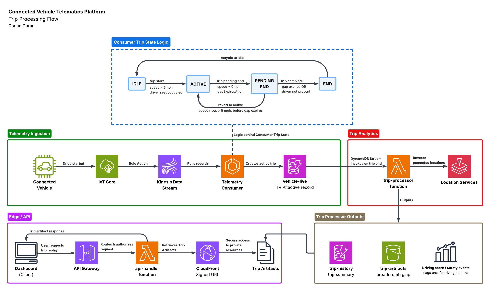
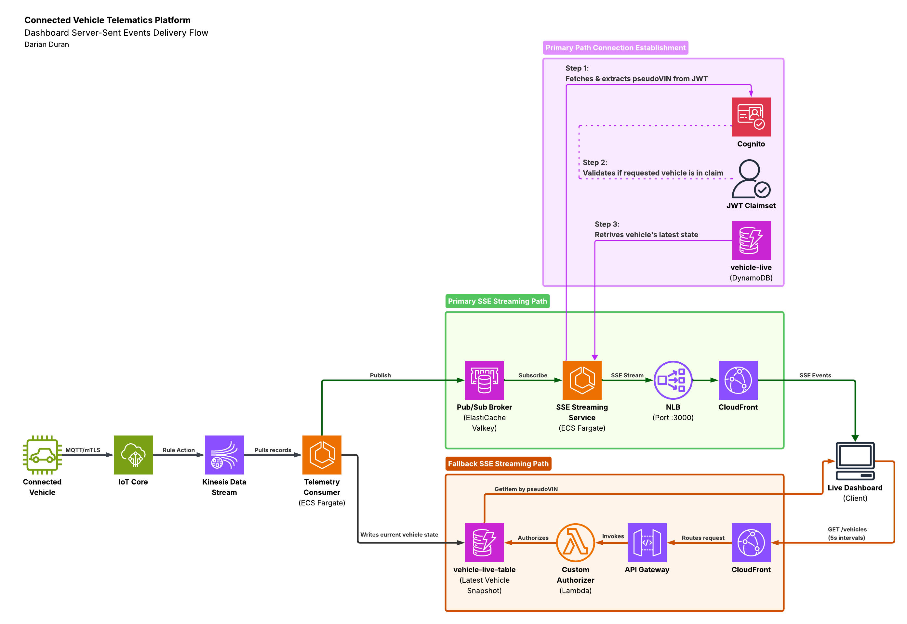
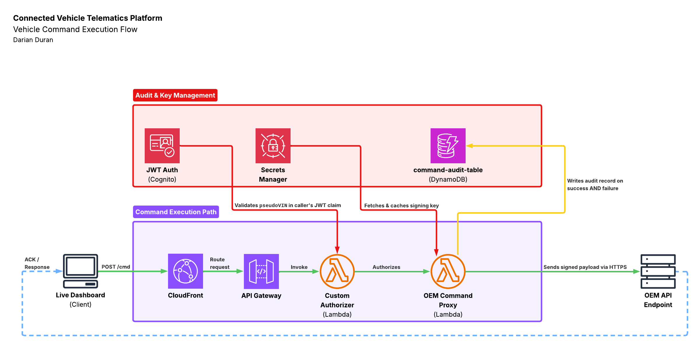
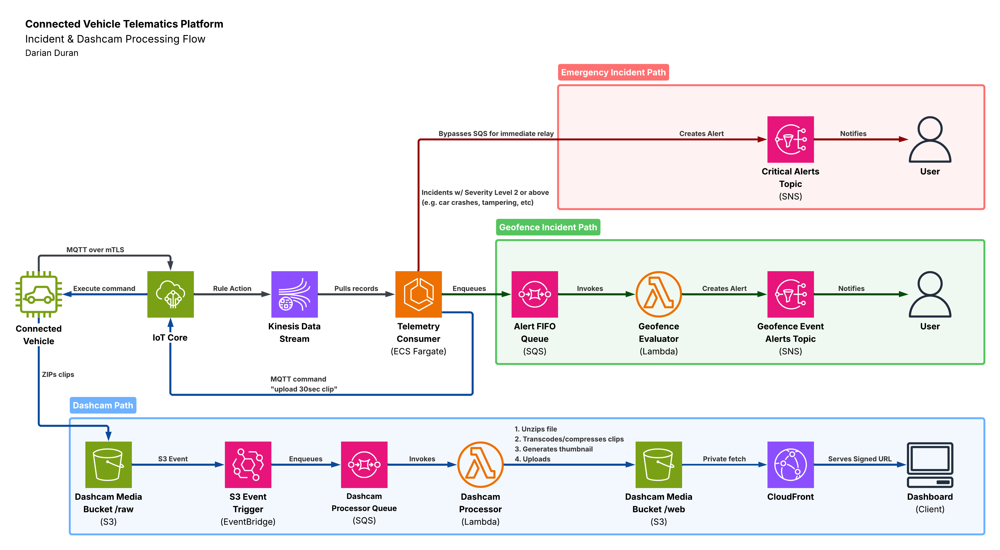
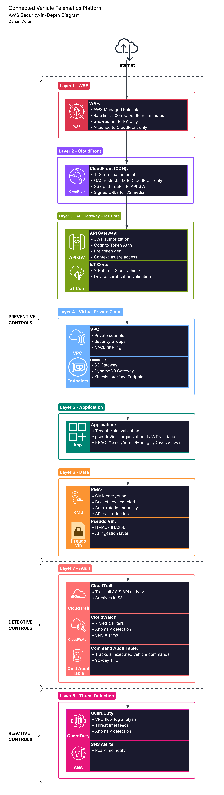

# 3.0 Solution Architecture

## 3.1 High-Level Architecture

### 3.1.1 Architecture Diagram

*Figure 1: Infrastructure Architecture Diagram*

### 3.1.2 Component Architecture

The platform is organized into five architectural concerns.

**Telemetry Ingestion Pipeline.** Vehicles are embedded with an edge device that decodes CAN bus signals and publishes telemetry data to AWS IoT Core via MQTT. IoT Core rule actions forward data to Kinesis Data Streams. A Telemetry Consumer Service (ECS Fargate) pulls records from the stream and processes data to multiple targets. At a high-level it sends data to Kinesis Firehose for archiving, writes DynamoDB for persistence, updates ElastiCache Valkey with live events, and enqueues several analytical workflows.

**Real-Time Dashboard Delivery.** The SSE Streaming Service (ECS Fargate) subscribes to Valkey channels and pushes Server-Sent Event updates to users' dashboards. In the event of SSE Streaming Service failure, the dashboard automatically reverts to direct DynamoDB polling for live updates.

**Data Persistence Layer.** DynamoDB serves as the primary operational store for vehicle state, trips, and organization data. S3 stores the telemetry archive, static web assets, media, logs, and reports. Timestream for InfluxDB stores time-series analytics for predictive maintenance.

**API and Command Execution.** API Gateway and an API Lambda function provide request handling. Cognito authorizes user requests and issues JWTs. The OEM Command Proxy performs a final ownership validation check and signs the payload with an OEM-trusted private key before egressing it.

**Observability and Security Monitoring.** CloudWatch and CloudTrail track, log, and alert on specific actions and metrics. Guard Duty provides managed passive threat detection and alerts on findings.

### 3.1.3 AWS Service Reference

| Category | Service | Architectural Role |
|---|---|---|
| Edge & API | CloudFront | CDN, provides TLS termination point and origin routing |
| | AWS WAF | Edge protection with rate limit abuse protection and geo-restrictions |
| | API Gateway | Handles request authorization and routing. Integrates with Lambda |
| | Cognito | Manages the user pool of the platform and JWT claims|
| Compute | ECS Fargate | Container compute for consumer and SSE streaming workflows |
| | ECR | Stores container images securely |
| | Lambda | Compute for API handling, async processing, and scheduled tasks |
| Streaming & Messaging | IoT Core | Connects to the vehicle and ingests telemetry data |
| | Kinesis Data Streams | Durable and real-time telemetry streaming service |
| | Kinesis Data Firehose | Specialized telemetry archive delivery to S3 |
| | SQS | Async workflow decoupling with durable retry |
| | SNS | Operational and security alert delivery |
| | EventBridge | Scheduled workflow triggers |
| Data Stores | DynamoDB | Primary operational store |
| | ElastiCache Valkey | Pub/sub broker between telemetry consumer and SSE streaming services |
| | S3 | Object storage for archives, web assets, media, logs |
| | Timestream for InfluxDB | Time-series store for predictive maintenance analytics |
| Networking | Cloud Map | Service discovery for internal resource communication |
| | NLB | Inbound SSE traffic routing to private subnet |
| Security | Secrets Manager | Secret storage and rotation |
| | SSM Parameter Store | Runtime config and feature flags |
| | KMS | Customer managed encryption keys |
| | ACM | Platform TLS certificate issuance and renewal |
| Observability | CloudWatch | Metrics, logs, dashboards, alarms |
| | CloudTrail | API and sensitive data access audit trail |
| | GuardDuty | Managed threat detection service |
| Enrichment | Location Services | Mapping and routing for vehicle tracking |

---

## 3.2 Data Flow Architecture

### 3.2.1 Telemetry Ingestion

*Figure 2: Telemetry Ingestion Flow*

### 3.2.2 Trip Processing

*Figure 3: Trip Processing Flow*

### 3.2.3 Dashboard SSE Delivery

*Figure 4: Dashboard SSE Flow*

### 3.2.4 Vehicle Command Execution

*Figure 5: Vehicle Command Execution Flow*

### 3.2.5 Alert and Dashcam Processing

*Figure 6: Alert and Dashcam Flow*

---

## 3.3 Multi-Tenancy and Tenant Isolation

The platform enforces isolation in multiple layers. Cognito JWT tokens carry `pseudoVIN` and `organizationId` claims. API Gateway and Lambda validate and authorize every request against the claims. The same claims apply for DynamoDB table partition keys. Tables that are scoped to specific vehicles use `pseudoVIN` pk and tables scoped to organizations use `organizationId`. All DynamoDB access operations are limited by the specific partition key to prevent cross-user data leakage.

---

## 3.4 Network Architecture

This platform deploys all non-data store services to us-east-1 with multi-AZ redundancy. In early stages, it does not make financial sense to provision multi-region as user base is low, and recovery workflow is quick. Instead, critical or non-recoverable resources are replicated to us-west-2. This primarily covers DynamoDB tables (Global Tables) and S3 buckets holding sensitive or hard-to-regenerate data (dashcam footage, CloudTrail logs, Cognito exports, fleet reports, trip archives). S3 CRR is deferred for the Parquet data lake and static web assets since the data lake is rebuildable from source and static assets are deployed from CI/CD. Cognito is replicated indirectly via a daily export pipeline. Additional details can be referenced in the *Resilience and Disaster Recovery* document.

All compute resources run in private subnets with no ingress internet access. A network load balancer is deployed to broker communication between CloudFront and the private subnet SSE streaming service. A NAT gateway is deployed to provide private subnet services with outbound communication. Generally, the NAT gateway is only used for communication to AWS Public Zone services such as CloudWatch. The OEM Signing Proxy Lambda function is the only compute service with direct internet egress to reach the OEM API endpoints.

VPC Gateway Endpoints for S3 and DynamoDB allow free and private connectivity to the data stores. Two VPC Interface Endpoints are provisioned for Kinesis Data Stream and Kinesis Firehose for dedicated and secure connectivity paths for core workflows.

| Subnet Tier | Resources |
|---|---|
| Public (2 AZs) | NAT Gateway, Network Load Balancer (NLB) |
| Private (2 AZs) | ECS Fargate services, VPC-attached Lambda functions, ElastiCache Valkey, Timestream for InfluxDB |

> Note: S3 and DynamoDB Gateway Endpoints apply to all subnets via route table entries, not a specific subnet tier.

| Endpoint | Type | Purpose |
|---|---|---|
| S3 | Gateway | Private access to S3, bypassing NAT |
| DynamoDB | Gateway | Private access to DynamoDB, bypassing NAT |
| Kinesis Data Streams | Interface | Private connectivity from Consumer to Kinesis |
| Kinesis Firehose | Interface | Private connectivity from Consumer to Firehose for archival delivery |

---

## 3.5 Security Architecture Overview

*Figure 7: Defense-in-Depth Security Model*

Security is layered so that no single point of failure exposes data. Additional details can be referenced in the *Security Framework* document.

| Layer | Control | Purpose |
|---|---|---|
| 1. Edge | AWS WAF | Abuse protection |
| 2. CDN | CloudFront | TLS termination point, origin access control, and signed asset URLs |
| 3. API / Device | API Gateway and IoT Core | JWT authorization for user requests, mTLS with connected vehicles |
| 4. Network | VPC | Private subnet isolation, security groups, NACLs |
| 5. Application | Tenant Verification | Validates tenant claims on every request and enforces RBAC |
| 6. Data | KMS and Data Pseudonymization | Customer-managed encryption keys, VIN pseudonymization to limit PII exposure |
| 7. Audit | CloudTrail and CloudWatch | API audit trail, metric alarms, command logging |
| 8. Threat Detection | Guard Duty | Threat detection across architecture with managed threat intel |

---

## 3.6 Key Design Decisions

Significant architectural choices are documented as Architecture Decision Records. The following decisions shape the platform's architecture:

| ADR | Decision | Summary |
|---|---|---|
| ADR-001 | Fargate over Elastic Kubernetes Service (EKS) | Container compute service decision|
| ADR-002 | Kinesis over MSK | Managed streaming with native AWS integration |
| ADR-003 | Fargate Spot for SSE Streaming Service | ECS Fargate Spot capacity for interruptible service |
| ADR-004 | IoT Core for ingestion | Managed MQTT with device authentication and rule actions |
| ADR-005 | VIN pseudonymization at ingestion layer | Masking PII data to limit exposure impact |
| ADR-006 | Firehose archival and Kinesis retention reduction | Firehose archives telemetry to S3 Parquet, Kinesis retention reduced to 24h |
| ADR-007 | SSE pub/sub selection | Valkey pub/sub for real-time dashboard delivery |
| ADR-008 | NLB for SSE Streaming Service | NLB for SSE Streaming connections instead of API Gateway |
| ADR-009 | Datastore evaluation | Consolidating DynamoDB tables and migrating specific data to better services|
| ADR-010 | Single region deployment | Single region deployment rationale and cross region replication |
| ADR-011 | IoT Core over FleetWise | IoT Core provides better control and costs than managed vehicle telematics service (Fleetwise) |
| ADR-012 | InfluxDB for predictive maintenance | Time-series analytics for component wear patterns |

---
[Requirements](02-requirements.md) | [Next: Technical Design](04-technical-design.md)